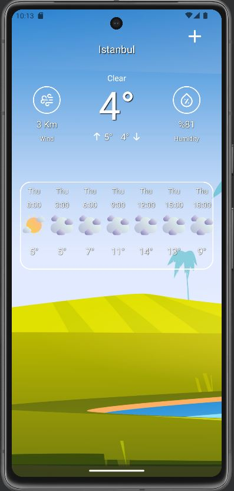
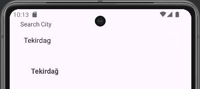
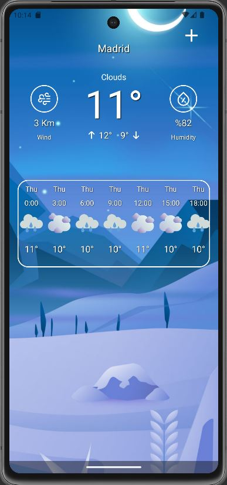

# WeatherAppAPI-Kotlin

Retrofit kullanarak internet üzerinden şehirlerin hava durumu tahmin verilerini çeken ve kullanıcıya gösteren bir mobil uygulamadır. MVVM mimarisi kullanılarak geliştirilmiştir.

## Özellikler

- **Gerçek zamanlı hava durumu tahmini**: Kullanıcılar seçtikleri şehir için güncel hava durumu tahminlerini görebilir.
- **Retrofit ile API Entegrasyonu**: İnternetten hava durumu verilerini almak için Retrofit kullanılmıştır.
- **MVVM Mimarisi**: 
- SharedPreferences

## Kullanılan Teknolojiler

- **Kotlin**
- **MVVM (Model-View-ViewModel) mimarisi**
- **Retrofit** (API ile veri alışverişi için)
- **LiveData ve ViewModel** (veri yönetimi için)
- **Coroutines** (asenkron işlemler için)

## Ekran Görüntüleri

Aşağıda uygulamanın bazı ekran görüntüleri bulunmaktadır:

## Kaynaklar
- [Ui Lover YouTube Kanalı](https://www.youtube.com/@UiLover) – UI tasarımı ve geliştirme konusunda ilham alınmıştır.

